- 12.12.2025 ДАТА НАЧАЛА ПЕРЕМЕН
- 1. Полная миграция данных из рп Obsidian Quartz
- 2. Анализ и полировка полученной информации
- 3. Перепись канонов:
	- 3.1 Приоритет: Изначальный мир, Лунный континент, Государства (В порядке убывания приоритета: Технократия, Альянс, Тау, Нова, Поднебесный Синдикат, Геохроноум, Инфириум, Академия механистов, Черный рынок), Внешняя политика, Экология, Культура народов, Этнос, Значимые персонажи/Личности, Технологии, Феномены, Конкретно КАРМА, Душа, Сущность, Астральное тело
	- 3.2 Средний приоритет: Законы физики касательно (остальных), полимерных энергий, Хронологическая история развития РП, История и культура Древних, Биология, Виды и Расы, Культизм
	- 3.3 Наименьший приоритет: Межмирие, Кошмар, Искажение, Артефакты, Минералы и т.д.
- 4. Оформление вики через Quartz с маркдауном Obsidian
- 5. Процесс переписи правил проведения РП, анкет, переделка RainБота для работы с вики "Библиотека Лапласа"
- 6. Принятие критики и резолюция
- 7. Открытие РП для всех.

```mermaid
graph TD
    %% --- Стилизация узлов ---
    classDef root fill:#111,stroke:#fff,stroke-width:3px,color:#fff,font-size:18px;
    classDef high fill:#7f1d1d,stroke:#fca5a5,stroke-width:2px,color:#fff;
    classDef med fill:#1e3a8a,stroke:#93c5fd,stroke-width:2px,color:#fff;
    classDef low fill:#374151,stroke:#d1d5db,stroke-width:2px,color:#fff;
    
    classDef groupLabel fill:#fff,stroke:#333,color:#000,font-weight:bold;
    classDef stateNode fill:#fff5f5,stroke:#ef4444,color:#000;
    classDef itemNode fill:#f3f4f6,stroke:#6b7280,color:#000;
    classDef karmaNode fill:#f0f9ff,stroke:#0ea5e9,color:#000;

    %% --- КОРНЕВОЙ БЛОК ---
    ROOT(["📜 ПЕРЕПИСЬ КАНОНОВ"]):::root
    
    %% ==============================
    %% 1. ВЫСОКИЙ ПРИОРИТЕТ
    %% ==============================
    ROOT --> P1("3.1 Высокий приоритет"):::high
    
    subgraph P1_Cluster [ ]
        direction TB
        style P1_Cluster fill:none,stroke:none

        %% География
        P1 --> GEO{"Мир и Локации"}:::groupLabel
        GEO --> G1["Изначальный мир"]:::itemNode
        GEO --> G2["Лунный континент"]:::itemNode

        %% Государства (Цепочка приоритета)
        P1 --> STATE_HEAD{"Государства (по убыванию)"}:::groupLabel
        
        %% Используем кавычки, чтобы избежать ошибки списка
        STATE_HEAD --> S1["1\. Технократия"]:::stateNode
		S1 --> S2["2\. Альянс"]:::stateNode
		S2 --> S3["3\. Тау"]:::stateNode
		S3 --> S4["4\. Нова"]:::stateNode
		S4 --> S5["5\. Поднебесный Синдикат"]:::stateNode
		S5 --> S6["6\. Геохроноум"]:::stateNode
		S6 --> S7["7\. Инфириум"]:::stateNode
		S7 --> S8["8\. Академия механистов"]:::stateNode
		S8 --> S9["9\. Черный рынок"]:::stateNode

        %% Социум
        P1 --> SOC{"Социум и Среда"}:::groupLabel
        SOC --> SC1["Внешняя политика"]:::itemNode
        SOC --> SC2["Экология"]:::itemNode
        SOC --> SC3["Культура и Этнос"]:::itemNode
        SOC --> SC4["Значимые персонажи"]:::itemNode

        %% Метафизика (Карма)
        P1 --> META{"Метафизика и КАРМА"}:::groupLabel
        META --> M1["Технологии и Феномены"]:::itemNode
        
        META --> K_CLUSTER[["Ядро ЦИКЛА"]]:::karmaNode
        K_CLUSTER -.-> K1("Карма"):::karmaNode
        K1 -.-> K2("Душа"):::karmaNode
        K2 -.-> K3("Сущность"):::karmaNode
    end

    %% ==============================
    %% 2. СРЕДНИЙ ПРИОРИТЕТ
    %% ==============================
    ROOT --> P2("3.2 Средний приоритет"):::med
    
    subgraph P2_Cluster [ ]
        direction TB
        style P2_Cluster fill:none,stroke:none
        
        P2 --> PHYS{"Физика и Энергии"}:::groupLabel
        PHYS --> PH1["Законы физики"]:::itemNode
        PHYS --> PH2["Полимерные энергии"]:::itemNode

        P2 --> HIST{"История и Биология"}:::groupLabel
        HIST --> H1["Хронология РП"]:::itemNode
        HIST --> H2["История Древних"]:::itemNode
        HIST --> H3["Виды и Расы"]:::itemNode
        HIST --> H4["Культизм"]:::itemNode
    end

    %% ==============================
    %% 3. НИЗКИЙ ПРИОРИТЕТ
    %% ==============================
    ROOT --> P3("3.3 Низкий приоритет"):::low
    
    subgraph P3_Cluster [ ]
        direction TB
        style P3_Cluster fill:none,stroke:none

        P3 --> ABSTR{"Абстракция"}:::groupLabel
        ABSTR --> A1["Межмирие"]:::itemNode
        ABSTR --> A2["Кошмар и Искажение"]:::itemNode
        
        P3 --> MAT{"Материальное"}:::groupLabel
        MAT --> MT1["Артефакты"]:::itemNode
        MAT --> MT2["Минералы"]:::itemNode
    end
```

